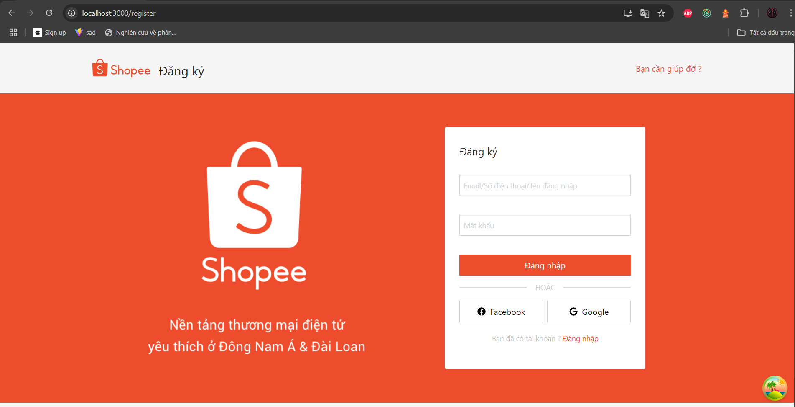

## Cài các thư viện cần thiết

`npm install`

## Chạy dự án

`npm start`

Ai rảnh cài thêm `vite` chạy cho nhanh

## Chú ý về cấu trúc file

Folder `Pages` chứa các trang
Các thành phần của trang nằm trong `components`

## Xử lí phân trang được giải quyết trong Dashboard

## Các trang liên kết

http://localhost:3000/dashboard

http://localhost:3000/login

http://localhost:3000/register


## Categories

Trong thư mục _api_ mình có tạo file _categories.ts_ để call api với axios
Gợi ý call api dùng React Query

```
const { data, isLoading, error } = useQuery({
    queryKey: ["categories"],
    queryFn: () => getCategories(),
    staleTime: 5 * 60 * 1000, // 5 minutes
  });
```

## Dashboard của Categories

Ở đây mình sử dụng redux-toolkit để tạo global state phục vụ chủ yếu cho phần xử lý dialog
# shopee-clone-fe
